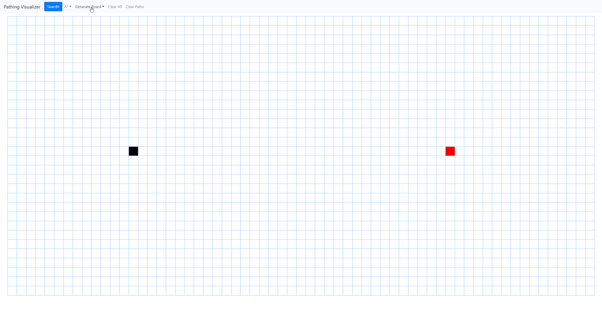

## Pathing Visualizer

This is an interactive website built in React to demonstrate three very common pathfinding algorithms. Dijkstra's, Greedy, and A*.

http://aaronleslie138.github.io/Pathing-Visualizer/  (Please use Google Chrome or Firefox)

It can generate its own Mazes and Blocks to test the pathfinding algorithms against, or you can use your mouse to draw your own obstacles.

The website is responsive, and works on various browser sizes. It even works in landscape mode on my phone, though that isn't a target use case.

Low Framerate Gif:

